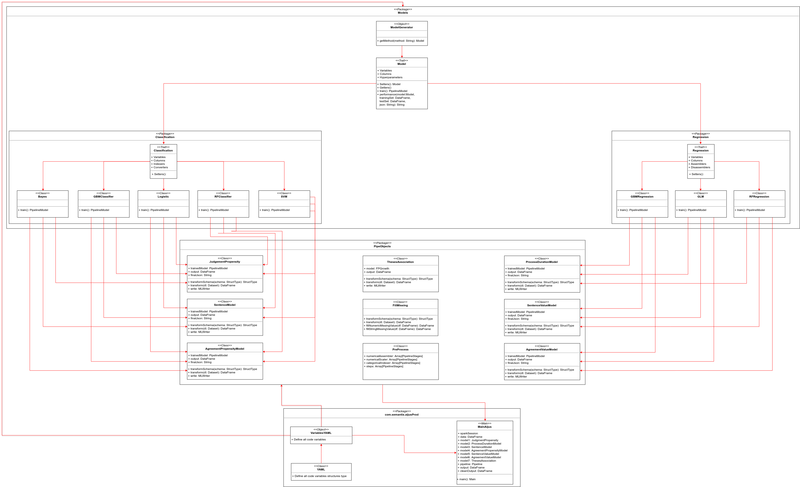

# Spark AIJUS Production

This folder contains all files needed to start an environment on a running cluster.

## Preparing the environment

Once one has a cluster up and running it's possible to use the **make_folders_send_files.sh** shell script to make all the directories needed both on the server and on the hadoop distributed file system (hdfs).

To run the script one just need to execute the following command:

> sh make_folders_send_files.sh arg1 arg2

- arg1: Full path to the pem file used to make ssh and scp commands to the server, ex.: "~/.ssh/juribot.pem"
- arg2: Full server master node DNS, ex.: "hadoop@ec1-23-45-678-910.compute-1.amazonaws.com"

This script gets it's on path (so it's dependent os the actual git sctructure) makes a ssh tunnel to the specified server, creates all directories, locally and on the hdfs, and transfer both the configuration file and the jar package via scp.

In this folder there is some files with examples on how to create a partitioned external table on hive pointing to files stores in AWS S3; how to add the content to the same table; and how to run the spark job on using client mode.

The code jar is stored under the folder: ~/aijusProd/jars and the configuration file is stored locally on server in ~/aijusProd/confFiles and on the hdfs /user/hadoop/aijusProd/confFiles

If the cluster is cloned using the previous **Cluster Chris** there is no need to create the table or add information to it.

The image below is a macro representation of the code structure with the central classes, variables and functions.

## Input Data

The Judgement Propensity model consists in determining whether an employee will or will not sue the client and for this it is being used only employee's labor and personal information present in a register table.

The Theses Association model uses a proper table in which all rows are itens vectors build from the table **Pedidos**

All other models are made using the same dataframe, a mix between lawsuits information with personal information too.

## Output
The outputs are tree dataframes stored on hive tables.

